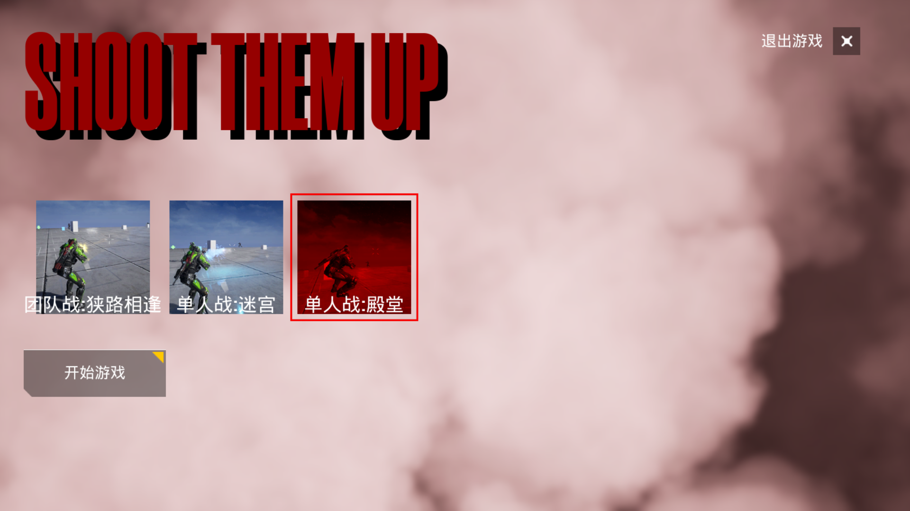
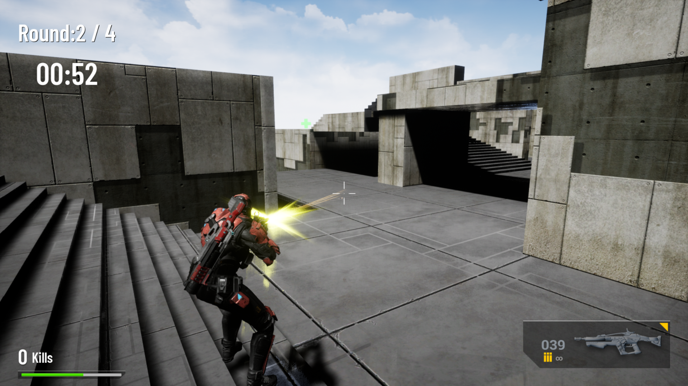
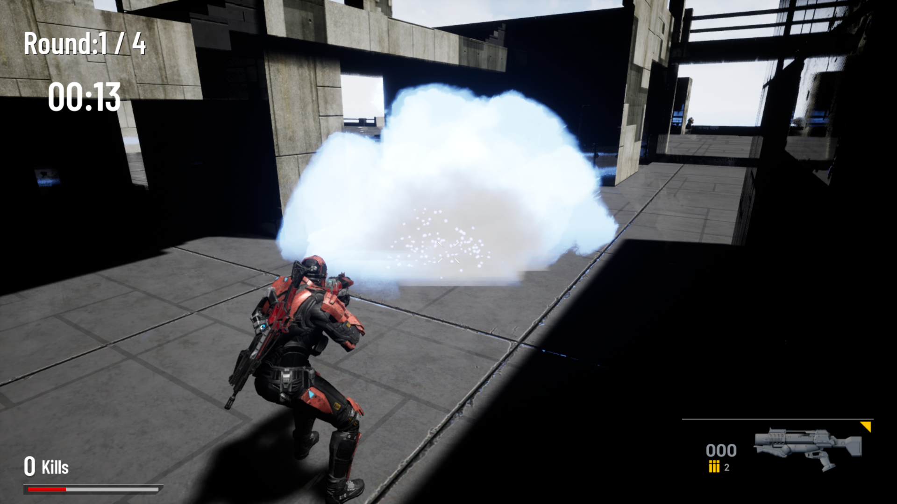
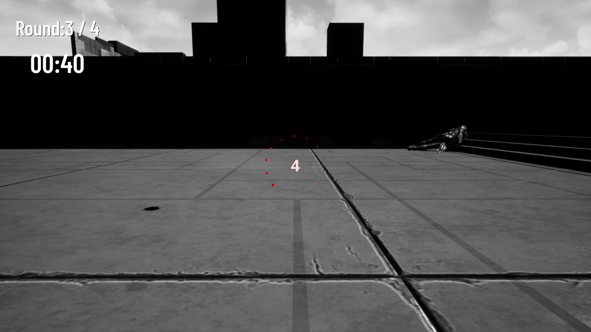
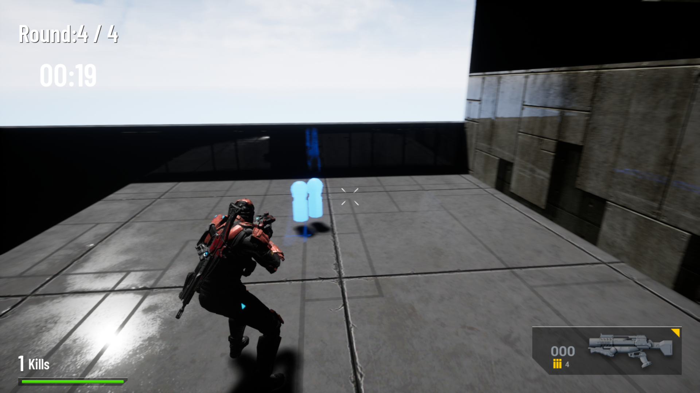
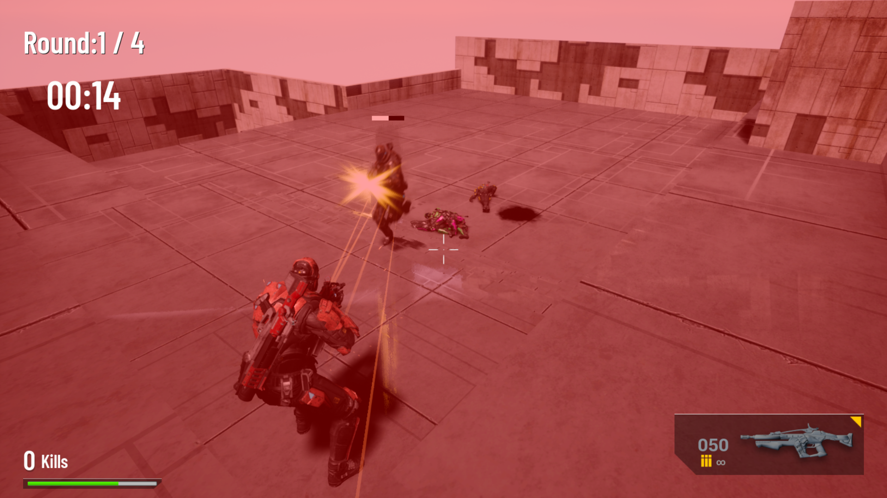
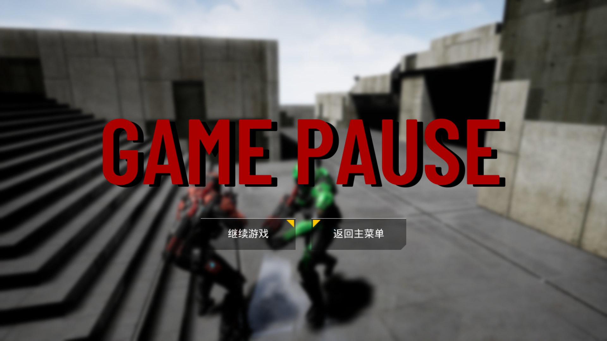
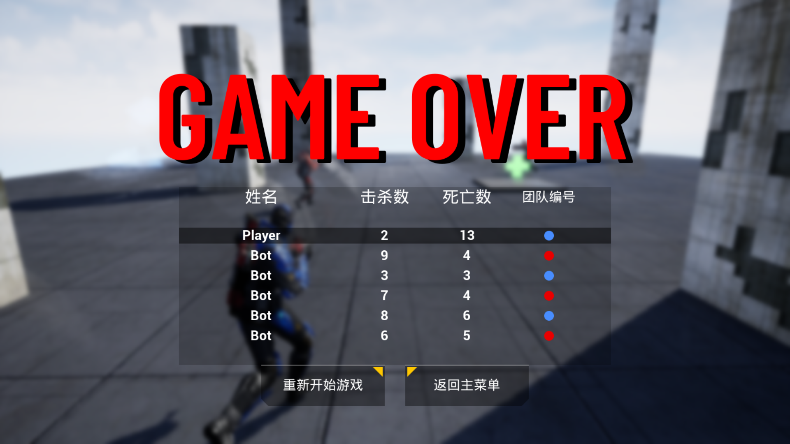

# Shoot Them Up

本项目是我在2022~2023学年寒假期间，跟随教程，基于UE4 C++编写的一个第三人称射击游戏

教程网址：https://www.udemy.com/course/unrealengine/

项目地址：https://github.com/unicorn2022/ShootThemUp

# 使用说明

如果是从git上直接clone的工程文件

1. 右击`ShootThemUp.uproject`，生成VS工程文件
2. 双击`ShootThemUp.sln`，点击`本地Windows调试器`，即可进入UE4界面，之后便是常规的用UE4导出游戏即可

如果是直接使用打包后的版本：

1. 双击`ShootThemUp.exe`，即可进入游戏

# 责任描述

1. 负责整个项目的构建和开发，使用UE4引擎实现游戏所需的各种功能
2. 使用自定义HUD及Widget，实现游戏的UI界面、不同关卡之间的切换
3. 使用自定义动画蓝图，实现角色移动、射击、更换武器等动画之间的切换与叠加等功能
4. 使用自定义Actor组件，实现角色血量管理、武器状态管理、拾取物交互等功能
5. 使用Niagara系统，实现特效的播放等功能
6. 使用AI系统，实现NPC角色巡逻、发现敌人并攻击、受击后反击等功能
7. 使用自定义SoundCue、SoundMix，实现有距离信息的音效、背景音乐等功能

# 游戏操作

## 主菜单：关卡选择

1. 双击进入游戏后，会进入主菜单界面
2. 游戏共有三个关卡，红色的为**当前选中关卡**，红色框为鼠标悬停关卡，点击后可以更改**当前选中关卡**
3. 点击开始游戏后，会直接进入**当前选中关卡**
4. 点击右上角的❌，即可退出游戏

## 游戏界面：玩家控制

1. 左上角为回合数及当前回合剩余时间，当前回合结束后，所有人会自动回到出生点

   

2. 右下角为当前武器类型及剩余子弹数，不同武器有不同的特效

   1. 步枪：每个弹夹50发子弹，无限弹夹，可以按**E**键进入瞄准模式
   2. 榴弹发射器：每个弹夹1发子弹，初始5个弹夹，打空后需要拾取掉落物补充
   3. 子弹打完后，需要自己按**R**键切换弹夹
   4. 按**Tab**键可以切换武器

   

3. 左下角为当前角色剩余血量、击杀数。角色被击杀后，一段时间后，会自动复活

   1. 在复活时，可以按**WASDQE**漫游场景
   2. 会在出生点复活
   3. 如果当前回合剩余时间过短时，就不会复活了

   

4. 玩家操作

   1. `WASD`：控制角色行走
   2. `Shift/鼠标右键`：控制角色奔跑
   3. `空格`：跳跃
   4. `E`：使用步枪时，进入瞄准模式
   5. `R`：切换弹夹
   6. `Tab`：切换武器
   7. `ESC / P`：暂停游戏
   8. `鼠标左键`：发射子弹

5. 当玩家拿到拾取物后，会根据拾取物的类别，增加血量/增加子弹数

   

## AI逻辑

1. AI会在场景中漫无目的的移动
2. 当发现不是自己队伍的敌人时，AI会对跟随他并进行射击
3. 如果玩家攻击到了AI，AI会感知到攻击并追逐玩家

## 暂停界面

1. 可以选择**继续游戏**或**返回主菜单**

## 结算界面

1. 可以选择**重新开始游戏**或**返回主菜单**
2. 此界面会显示所有玩家的击杀数、死亡数、团队编号

## 游戏特点

1. 当角色从高空坠落时，会有坠落伤害
2. 击中角色不同的位置，会有不同的伤害
   1. 如击中头部会直接击杀，而击中手的伤害会比击中身体的伤害更低
   2. 击中不同地方，会有不同的击中特效
3. 角色死亡时，尸体会有物理模拟
4. 场景中的声音会按照距离角色的远近，实现混音效果